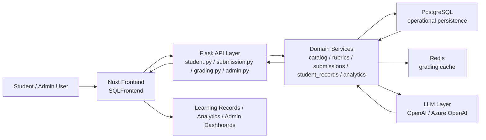
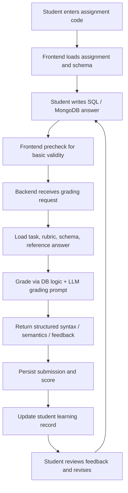
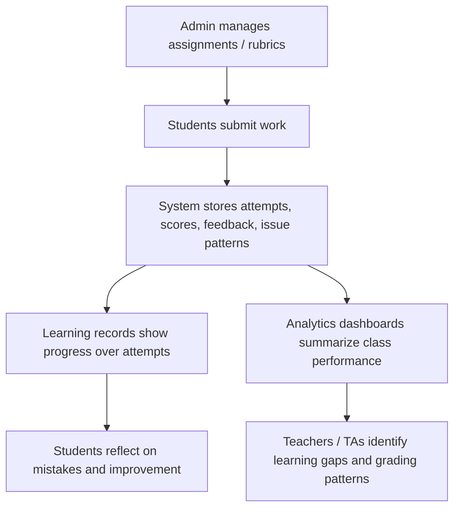

# PolyU Interview Project Flow Summary

## Recommended Project to Present

**Project:** PolyU GenAI SQL Learning Platform
**Repository:** `GenAI_SQL_and_ShortQuest_System`
**Primary focus for interview:** `GenAISQLServer`

This is the strongest project to present for the Project Associate / Project Assistant interview because it matches the job requirements closely:

- responsive frontend application
- backend API and system integration
- SQL and NoSQL data handling
- AI / LLM integration for automated feedback
- analytics and reporting for teaching and learning

Use **ShortQuest** only as a short extension point near the end, not as the main story.
For the main 5 to 10 minute presentation, keep the narrative centered on the **SQL learning platform**.

---

## 30-Second Project Pitch

I worked on an AI-supported SQL learning platform designed for teaching and formative assessment.
The system allows students to attempt SQL or MongoDB-style database tasks, receive automated feedback and scoring, revise their answers through multiple attempts, and then review their progress through learning records and analytics dashboards.
On the operational side, it also provides admin workflows for managing assignments, rubrics, grading logic, and learning analytics, so the platform supports both students and teaching staff.

---

## Recommended Presentation Goal

Do not present this as just "a grading website".

Present it as:

**an AI-supported teaching platform that closes the loop between assessment, feedback, revision, and learning analytics**

That framing is much closer to the posted job:

- AI-supported learning platform
- teaching and learning reports
- full-stack development
- database and API design
- educational objectives

---

## Suggested 6-Part Presentation Flow

This structure fits roughly **6 to 8 minutes**.
If you need closer to **10 minutes**, expand sections 4 and 5 with one concrete example each.

### 1. Problem Context

In SQL learning, students often know the topic conceptually but struggle to understand why a query is wrong.
Traditional grading is slow, and the feedback loop is weak.
Teachers and TAs also face workload pressure when they need to review many submissions and summarize learning progress.

### 2. Project Objective

The goal of the platform was to build a system that could:

- let students submit SQL or NoSQL answers in an interactive web interface
- provide structured AI-supported feedback and scoring
- support repeated revision attempts instead of one-off grading
- preserve learning records for reflection
- give teachers and admins analytics for teaching improvement

### 3. System Overview

The system is a production-facing educational monorepo with:

- a SQL frontend for students and admin users
- a Flask backend for grading, content management, and analytics
- PostgreSQL for operational persistence
- Redis for caching
- OpenAI / Azure OpenAI integration for grading
- a related ShortQuest subsystem for short-answer grading

### 4. Core Student Flow

The core learning flow is:

1. A student enters an assignment code.
2. The frontend loads assignment tasks and schema information.
3. The student writes a SQL or MongoDB-style answer.
4. The backend validates context, retrieves rubric and reference data, and sends grading prompts to the LLM or grading logic.
5. The result returns structured scores and feedback.
6. The submission is stored as part of the student learning record.
7. The student revises and improves over multiple attempts.

This is the most important section of the presentation.
It shows that the platform is not only about "automation", but about **learning through iterative feedback**.

### 5. Teaching / Admin Flow

On the admin side, the platform supports:

- assignment and quiz authoring
- rubric configuration
- grading workflow support
- student record review
- analytics views for learning performance and grading trends

This matters because a learning platform is only useful if it works operationally for educators as well.

### 6. My Contribution and Outcomes

Frame your work as full-stack, product-facing, and educationally aligned:

- I worked across frontend, backend, grading flow, and analytics surfaces.
- I helped structure the student submission-to-feedback pipeline.
- I improved maintainability by splitting backend responsibilities into domain services.
- I worked on frontend learning records and analytics views so the system did not stop at scoring, but also supported reflection and teaching insight.
- I also worked on stability improvements, API consistency, and operational documentation for a production-facing educational system.

---

## Architecture Flow Chart

---

## Student Learning Flow Chart

---

## Teaching and Analytics Flow Chart

---

## Repo-Grounded Technical Talking Points

Use these if the panel asks how the system is actually organized.

### Frontend

- The student assignment flow is implemented in `GenAISQLServer/SQLFrontend/pages/assignment.vue`.
- Session and submission behavior are organized in `features/assignment/composables/useAssignmentSession.js`.
- Learning record views are implemented in `features/learning-records/components/RecordDetail.vue` and related components.
- Analytics uses `echarts` and `vue-echarts`, which is a practical choice for maintainable, higher-complexity educational dashboards.

### Backend

- Student-facing endpoints are handled in `GenAISQLServer/SQLBackend/src/api/student.py`.
- Submission persistence is handled in `GenAISQLServer/SQLBackend/src/api/submission.py`.
- Core grading orchestration is handled in `GenAISQLServer/SQLBackend/src/api/grading.py`.
- Backend responsibilities are split into domain services such as `catalog.py`, `rubrics.py`, `submissions.py`, `student_records.py`, `analytics.py`, and `database_service.py`.

### AI / Data

- LLM prompt logic is handled in `src/services/llm_service.py`.
- Operational data is persisted in PostgreSQL.
- Redis is used for grading cache paths.
- The system supports both SQL and MongoDB-style grading scenarios.

---

## Strong Contribution Framing

Because the interview explicitly asks for **your specific contributions**, use claims that are both strong and defensible.

### Version A: Full-Stack Owner Framing

I worked as a full-stack developer on the platform.
My work covered frontend interaction flow, backend API and grading orchestration, database-related logic, AI integration, and the learning-record / analytics experience.
I also spent significant effort on system stability and maintainability, because this was a production-facing teaching platform used in real educational workflows.

### Version B: Product + Architecture Framing

My role was not only to implement isolated features, but to connect the whole learning loop.
I helped make sure the platform could take a student submission, grade it through AI-supported logic, store the result, and then surface it back through learning records and analytics so that both students and teachers could act on the results.

### Version C: If You Want More Concrete Engineering Language

My contribution focused on three layers:

1. student-facing workflow, including assignment loading, submission, feedback, and revision
2. backend service design, especially grading orchestration, API consistency, and persistence logic
3. post-submission insight layers, such as learning records and analytics dashboards

---

## Evidence-Based Achievement Points

These are grounded in the current repo structure and recent engineering work.

- The project supports both **student flow** and **admin / teaching flow**, which makes it a real platform rather than a prototype page.
- The grading flow separates **syntax** and **semantic** evaluation, which is important for meaningful educational feedback.
- The system keeps **attempt-level submission history**, enabling students to review improvement rather than only seeing a final score.
- The platform includes **learning records** and **analytics dashboards**, which align directly with teaching and learning reporting.
- Recent work in the repo shows ongoing improvements in:
  - backend service modularization
  - analytics refinement
  - NoSQL support tightening
  - learning-record progress visualization
  - frontend admin API consolidation

Recent commits that support this story include:

- `28e5ffc` refactor: split SQL backend domain services and remove `document_service`
- `435b0b4` feature(sql-backend): add TA grading comparison and flexible analytics windows
- `2d6a2f7` feature(sql-frontend): redesign admin analytics and add AI-vs-TA analysis workspace
- `13f62b5` feature(sql-frontend): enrich student learning records with progress and timeline insights
- `79473a9` feat: tighten nosql grading and source schema from backend
- `cedbdb4` refactor: centralize sql frontend admin api clients

---

## Recommended 1-Minute Demo Story

If the panel wants a quick live explanation while you show screenshots:

1. Show the assignment page.
2. Explain that students enter a task code and receive the schema and task list.
3. Show where a student writes the SQL answer.
4. Explain that the system grades syntax and semantics separately and returns feedback.
5. Show that attempts are stored and visible in learning records.
6. End with analytics or admin view to show that this is useful for teaching, not only for automatic marking.

That sequence is much better than switching randomly between pages.

---

## Suggested Slide Deck Structure

If you convert this into PowerPoint or Canva, use roughly:

### Slide 1

**Project Title**
AI-Supported SQL Learning Platform for Teaching, Feedback, and Learning Analytics

### Slide 2

**Problem and Motivation**
Slow feedback, limited revision visibility, teacher workload, weak analytics

### Slide 3

**System Architecture**
Use the architecture flow chart

### Slide 4

**Student Workflow**
Use the student learning flow chart and one assignment screenshot

### Slide 5

**Learning Records and Analytics**
Show how submissions become progress evidence and class-level insight

### Slide 6

**My Contributions and Key Results**
Use the contribution framing and achievement bullets

---

## Short English Speaking Script

Here is a concise script you can speak directly:

> I would like to present an AI-supported SQL learning platform that I worked on.
> The main goal of this project was to improve the feedback loop in database learning.
> In many SQL courses, students may receive a score, but they do not always understand what went wrong or how they improved over time.
> To address this, we built a full-stack platform where students can attempt SQL or MongoDB-style tasks, receive structured feedback, revise their answers, and review their learning records across attempts.
> On the backend, the system manages grading orchestration, rubric handling, persistence, and analytics support.
> On the frontend, we designed flows for assignment solving, feedback display, learning record review, and admin analytics.
> One part I particularly focused on was connecting the whole learning loop, from submission to feedback to progress visualization, so the system supports both student learning and teaching insight.
> This project helped me strengthen my experience in frontend and backend development, API design, database-oriented systems, and AI integration in a real educational context.

---

## Likely Interview Questions

### Why did you use AI here instead of rule-based grading only?

Because rule-based checking can validate some structural correctness, but educational feedback often requires more flexible evaluation of semantic intent and useful feedback wording.
The AI layer helps provide richer formative feedback, while the system still keeps structured rubrics, database context, and persistence around it.

### What was technically challenging?

The main challenge was making the system useful in a real teaching workflow, not just producing a model response.
That meant handling frontend-backend contracts, grading reliability, persistence of attempts, analytics, and maintainability together.

### What did you learn from this project?

I learned that educational AI systems need more than model integration.
They need strong workflow design, data structure, operational stability, and a clear feedback loop that actually supports learning.

---

## How to Use This File Next

Recommended next step:

1. Use this markdown as the content base.
2. Export the three mermaid charts into images if Canva does not render them directly.
3. Add 3 to 5 screenshots:
   - assignment page
   - grading feedback area
   - learning records page
   - analytics/admin page
4. Convert the contribution section into your own exact wording based on what you personally built.

---

## File Note

This summary is intentionally written in **presentation English**, not engineering-doc English, so you can reuse it directly in ChatGPT, Canva, or PowerPoint drafting.
