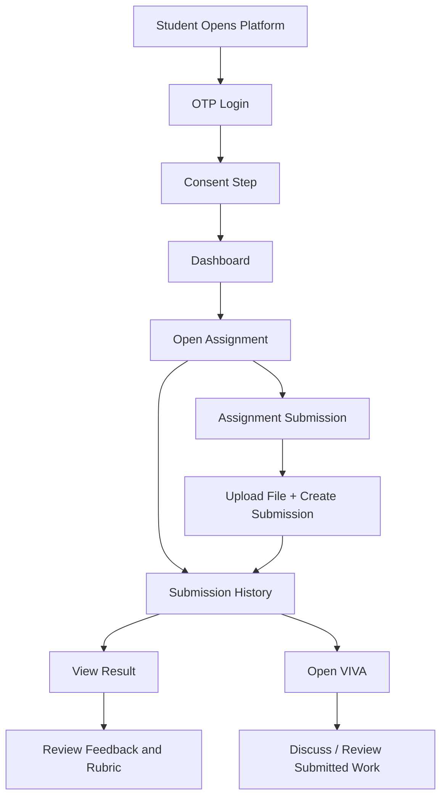
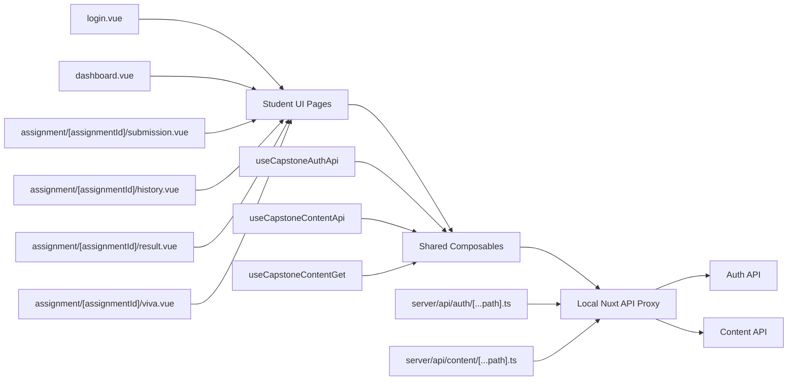

# Capstone Success Student Flow Interview Summary

## Purpose

This document is a presentation-ready summary for the PolyU interview task.
It focuses on the `student` side of this repository as a strong project example, especially the assignment submission journey, because that flow demonstrates:

- full-stack style front-end thinking
- UI delivery against fixed design requirements
- API integration discipline
- workflow design for students
- AI-adjacent learning support through result review and VIVA follow-up

You can use this file directly as source material for ChatGPT or Canva when turning it into slides.

---

## 1. Short Project Positioning

### One-sentence version

Capstone Success is a student-facing learning support platform that helps students log in securely, review learning materials, submit assignments, check AI-supported feedback, and continue to VIVA-style follow-up interactions in one connected workflow.

### Interview-friendly version

This project is a student portal designed for capstone learning support. My work focused on the student-side user journey, especially the assignment flow, where students move from login and dashboard navigation into submission, submission history, result review, and AI VIVA follow-up. The project required high-fidelity front-end implementation, reusable UI patterns, and disciplined integration with documented API contracts.

---

## 2. What Problem This Project Solves

From a student perspective, assignment work is often fragmented:

- login and identity verification happen in one place
- course and assignment information live in another place
- submission records are hard to track
- feedback is delayed or difficult to interpret
- students do not always know how to improve after submission

This project brings those steps into one structured flow:

1. authenticate the student
2. show upcoming work on the dashboard
3. let the student submit files through a guided process
4. show submission history and attempts clearly
5. present feedback and rubric-related information
6. support follow-up discussion through an AI VIVA experience

---

## 3. Scope I Would Present in the Interview

For a 5 to 10 minute presentation, the strongest demo is not the whole product. It is one complete student journey:

1. `Login`
2. `Consent`
3. `Dashboard`
4. `Assignment Submission`
5. `Submission History`
6. `Submission Result`
7. `VIVA`

This gives a clean story:

- secure entry
- clear task discovery
- real submission flow
- traceable student attempts
- AI-supported feedback loop

Relevant implementation areas in this repo:

- `student/app/pages/login.vue`
- `student/app/pages/dashboard.vue`
- `student/app/pages/assignment/[assignmentId]/submission.vue`
- `student/app/pages/assignment/[assignmentId]/history.vue`
- `student/app/pages/assignment/[assignmentId]/result.vue`
- `student/app/pages/assignment/[assignmentId]/viva.vue`
- `student/app/composable/useCapstoneContentFetch.ts`
- `student/app/composable/useCapstoneContentApi.ts`
- `student/server/api/content/[...path].ts`
- `student/server/api/auth/[...path].ts`

---

## 4. Product Flow Summary

### Student-facing flow

1. The student enters the platform through OTP-based login.
2. After verification, the student proceeds to the consent step.
3. The dashboard loads assignments and deadlines from the content API.
4. The student opens either:
   - the assignment history page to review attempts, or
   - the submission page to start a new attempt.
5. On submission, the system:
   - computes the file hash,
   - requests an upload ticket,
   - uploads the file to a presigned URL,
   - completes the upload,
   - creates the submission record.
6. After submission, the student is redirected back to submission history.
7. From history, the student can continue to:
   - `Result` to review grading-related feedback
   - `VIVA` to review or discuss the submitted work further

### High-level flow chart

---

## 5. Technical Logic and Procedures

### A. Login and access flow

The login page implements an OTP-based authentication flow:

- student enters email
- frontend requests OTP generation
- student enters OTP code
- frontend verifies OTP
- frontend refreshes or reads access token
- frontend fetches current user info
- frontend navigates to consent

Why this matters in presentation:

- it shows secure entry rather than a fake login page
- it demonstrates integration with an authentication service
- it shows the platform is designed for real student identity handling

### B. Dashboard flow

The dashboard works as the main decision point:

- it loads courses
- then loads assignments by course
- then loads submissions by assignment
- it turns those into deadline/task cards
- buttons route the student to either history or a new submission attempt

This is a good example of transforming backend data into a simpler UI view-model for students.

### C. Assignment submission flow

This is the strongest technical demo in the student project.

The submission page does not just send one form. It orchestrates a multi-step file submission process:

1. load assignment detail
2. derive `course_id` from assignment detail
3. load course detail
4. load previous submissions for attempt counting
5. student selects file
6. frontend computes SHA-256 hash
7. frontend requests upload ticket from API
8. frontend uploads file through presigned URL
9. frontend calls upload completion endpoint
10. frontend creates the assignment submission
11. frontend stores a local submission-to-file mapping for downstream retrieval
12. frontend routes to submission history

### D. History, result, and VIVA follow-up

After submission, the student does not lose context.

The history page:

- lists attempts
- computes latest attempt status
- shows usage against submission limit
- exposes result and VIVA actions per attempt
- displays rubric information using existing accordion patterns

The result page:

- loads the current submission
- loads related tasks and feedback
- maps task feedback into readable student-facing sections
- keeps the route scoped by assignment id and attempt id

The VIVA page:

- loads assignment and submission context
- resolves the submitted file
- prepares the student for post-submission review or discussion

---

## 6. Architecture Flow Chart

This chart is useful if the interviewer asks about system logic instead of just the UI.

### Why this architecture is worth mentioning

- front-end pages stay relatively clean
- integration logic is centralized in composables
- local proxy endpoints keep the browser side aligned with runtime config
- the same structure supports both API-first mode and mock-friendly UI development

---

## 7. My Specific Contributions

Adjust the wording to match your exact ownership, but based on this repo, this is the strongest and most defensible version to present:

### Contribution set 1: Student workflow design and implementation

I worked on the student-side journey so that the product behaves like one connected experience instead of a group of disconnected pages. In particular, I focused on the assignment flow from dashboard entry to submission, submission history, result review, and VIVA follow-up.

### Contribution set 2: Route and state cleanup

I helped migrate the assignment journey into clearer parameterized routes such as:

- `/assignment/{assignmentId}/history`
- `/assignment/{assignmentId}/submission`
- `/assignment/{assignmentId}/result`
- `/assignment/{assignmentId}/viva`

This made the page structure more explicit and easier to reason about than older query-based page patterns.

### Contribution set 3: Shared API integration pattern

I used shared composables and a local proxy pattern to keep the front end aligned with the documented API instead of hardcoding endpoint logic inside each page. That reduced duplicated integration logic and made the student flow easier to maintain.

### Contribution set 4: Multi-step submission pipeline

I implemented or stabilized the real submission procedure rather than a fake upload UI. That included:

- file hash generation
- upload ticket creation
- presigned upload
- upload completion
- submission creation
- redirecting students into the correct post-submission flow

### Contribution set 5: Error visibility during development

During development, I kept failures visible instead of masking them with silent fallbacks. That helped surface backend or data issues earlier, which is important in a project that still needs reliable integration and QA.

---

## 8. Key Achievements I Would Highlight

### Product achievement

Built a more coherent student assignment journey, so students can move from discovering a task to submitting work and reviewing outcomes without losing context.

### Engineering achievement

Improved maintainability by consolidating repeated API fetch logic into shared composables and by using route structures that better match the actual assignment entity.

### UX achievement

Kept the student pages aligned with a strict PDF-driven UI delivery process, which is useful in stakeholder-heavy projects where layout fidelity matters.

### Process achievement

Worked in a staged, checkpointed way for risky flow migration, which reduced rollback risk and made validation easier.

---

## 9. Good Demo Sequence for the Interview

If you only have 5 to 10 minutes, use this order:

1. Show the login page briefly.
2. Explain OTP verification and consent transition.
3. Open the dashboard and point out that it is data-driven from assignments and submissions.
4. Click into a new assignment submission.
5. Explain the real upload procedure:
   - hash
   - upload ticket
   - upload
   - complete
   - create submission
6. Show the submission history page and explain attempt tracking.
7. Open the result page and explain feedback retrieval.
8. Open the VIVA page and explain how this extends learning beyond file upload.

### Best message to leave with the interviewer

The value of this project is not just the UI. It is that I connected the student journey, the data flow, and the API integration so the product supports a full learning loop rather than a single isolated page.

---

## 10. 5 to 10 Minute Presentation Structure

### Slide 1: Project overview

Title idea:

`Capstone Success Student Flow: From Submission to Feedback`

Talk track:

This project is a student-facing capstone support platform. My focus was the student journey, especially the assignment workflow from login and dashboard discovery to file submission, feedback review, and AI-supported VIVA follow-up.

### Slide 2: Problem and goal

Talk track:

Students often face fragmented systems for submitting work and understanding feedback. My goal was to make the student experience more connected, more traceable, and easier to use, while keeping the front end aligned with documented APIs and fixed design requirements.

### Slide 3: Product flow

Use the first Mermaid chart.

Talk track:

This is the core student flow I worked on. The student logs in, reaches the dashboard, starts an assignment, submits work, checks submission history, reviews results, and continues to VIVA discussion. I wanted the workflow to feel continuous instead of fragmented.

### Slide 4: Technical logic

Use the architecture chart.

Talk track:

On the implementation side, I kept the pages thin and pushed integration logic into shared composables and local proxy endpoints. That helped reduce duplication and made the flow easier to maintain and debug.

### Slide 5: My contribution

Talk track:

My contributions included building the student assignment flow, improving route design, standardizing shared API integration patterns, and implementing the real file submission pipeline including upload ticketing and submission creation.

### Slide 6: Outcome and reflection

Talk track:

This project strengthened my ability to connect UI design, workflow logic, and API integration. It also taught me the importance of building with reusable patterns, keeping errors visible during development, and designing systems around the actual user journey.

---

## 11. English Speaking Version

You can use this as a base script and shorten it during rehearsal.

### Opening

Hello, today I would like to introduce one of my recent projects, the student-side workflow of a platform called Capstone Success. This platform is designed to support students throughout their capstone learning process. My main focus was the assignment journey, including login, dashboard navigation, assignment submission, submission history, result review, and VIVA follow-up.

### Problem

The main problem I wanted to address was fragmentation. In many academic systems, students can submit work, but they do not have a smooth process for tracking attempts, reviewing feedback, and understanding how to improve. So I focused on building a connected workflow instead of isolated pages.

### What I built

On the front-end side, I implemented and refined the student assignment flow. I also aligned the UI closely with fixed design specifications and reused shared components wherever possible. On the integration side, I used shared composables and local proxy endpoints so that the front end remained aligned with the documented API contracts.

### Technical highlight

One technical highlight was the assignment submission pipeline. The system does not only upload a file. It first computes a file hash, requests an upload ticket, uploads the file through a presigned URL, completes the upload, and then creates the final submission record. After that, the student is redirected to the submission history page, where they can continue to the result page or the VIVA page.

### Contribution

My contribution was not only implementing individual pages, but also connecting the workflow logically. I helped make the student journey more maintainable by using parameterized routes, shared API patterns, and explicit error handling during development.

### Closing

This project helped me strengthen both my UI implementation skills and my system thinking. I learned how to connect user experience, engineering structure, and API integration in a way that supports a complete learning workflow.

---

## 12. Short Achievement Phrases for Slides

If you want concise slide bullets, these are safe options:

- Built a connected student assignment workflow from login to feedback review
- Implemented a real multi-step file submission pipeline
- Improved maintainability through shared composables and route cleanup
- Kept front-end integration aligned with documented API contracts
- Delivered UI in a strict design-driven workflow

---

## 13. Demo Safety Notes

Before the interview demo, check these points:

1. Use a tested assignment id and submission id.
2. Confirm OTP login environment is available, or prepare screenshots if the auth environment is unstable.
3. Confirm backend data exists for:
   - assignment detail
   - submissions
   - result tasks
   - file attachment relations
4. If live backend data is incomplete, prepare screenshots or a video backup of:
   - dashboard
   - submission page
   - history page
   - result page
   - viva page

This matters because some integration notes in the repo show that rubric, task, or file-linkage data can depend on backend readiness for specific records.

---

## 14. Suggested Visual Assets for Canva or PPT

Recommended slide assets:

- one screenshot of the dashboard
- one screenshot of assignment submission
- one screenshot of submission history
- one screenshot of result or VIVA
- the two flow charts in this document
- one slide with a simple table:

| Area | What I Did |
|---|---|
| UI | Implemented student-facing pages with reusable components |
| Workflow | Connected login, dashboard, submission, result, and VIVA |
| API | Used shared composables and local proxy integration |
| Engineering | Improved route clarity and kept error handling explicit |

---

## 15. Best Framing for This Interview

Because the job description mentions:

- React.js / Next.js front-end work
- Node.js / Python back-end collaboration
- database-aware application work
- AI / LLM integration
- educational technology context

this project is a good fit to present because it shows:

- front-end implementation ability
- API integration discipline
- educational workflow understanding
- early-stage AI-supported learning experience design

If you want, the next step can be:

1. convert this into a 6-slide English presentation outline
2. convert this into a more polished Canva-ready slide script
3. generate a shorter 90-second self-introduction that matches this project story
